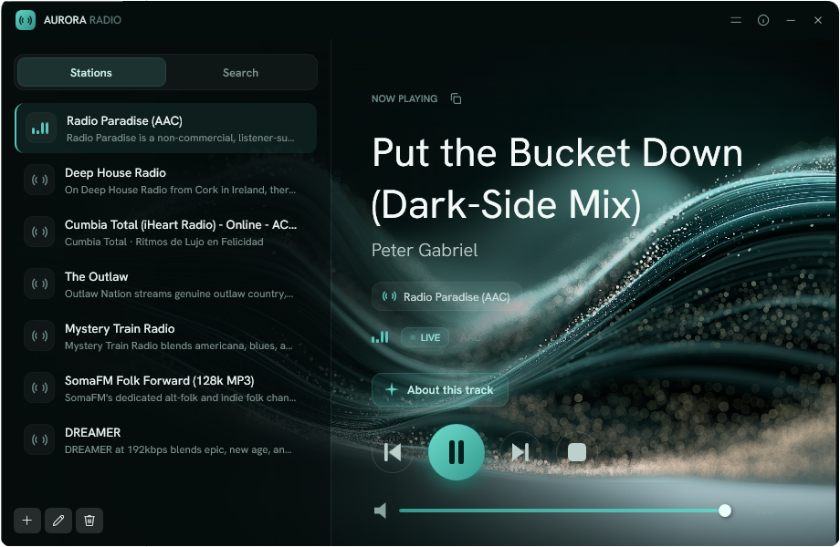

# Crystal Radio

A vibe-coded lightweight Windows desktop app for playing internet radio streams (Icecast/Shoutcast),
with playback surfaced natively in the OS:

- **System Media Transport Controls (SMTC)** — the now-playing widget in the Windows 11
  volume/quick-settings flyout and lock screen, plus hardware media-key handling.
- **Taskbar thumbnail buttons** — play/stop shown in the live preview when hovering the
  taskbar icon.

Optionally, describe a vibe in plain language ("something mellow for late-night coding")
and the app finds real, playable stations via **AI-assisted search** (requires an
Anthropic API key).

Built with WPF on .NET 10, using the [BASS](https://www.un4seen.com/) audio library.



## Three modes

- **Radio** — play stations, see live track titles, save songs off the stream.
- **Library** — play your saved songs, or ask for a playlist built from them by mood.
- **DJ** — describe a vibe and the app assembles a mix on the fly, harvesting songs from
  live stations that match it.

## Features

- Stream AAC and MP3 internet radio.
- **Live track titles** via ICY metadata.
- **Station management** — add / edit / delete stations, persisted as JSON.
- **Save the song that's playing** — the stream is continuously recorded to a rolling
  cache, so a song can be saved *after* you've heard it, cut at its real track
  boundaries.
- **AI-assisted search** — describe a vibe, get real playable stations (optional; see
  below).
- **AI-curated playlists** — describe a mood and get a running order from your own saved
  songs (optional; needs an API key).
- **DJ mode** — a self-refilling mix from live radio: stations are chosen for your prompt,
  harvested headlessly, checked by a local music/speech detector, and sequenced with
  crossfades and spoken-style intro lines. Bridges to live radio whenever the mix runs
  dry, so it never falls silent (optional; needs an API key).
- **"About this track"** — an on-demand AI briefing (web-sourced) about the now-playing
  song and artist, shown inside the player (optional; needs an API key).
- **Lyrics** — the words to whatever is playing, in any of the three modes, fetched from
  [LRCLIB](https://lrclib.net). No API key needed. Coverage is partial (measured at 37% of
  harvested tracks — LRCLIB skews mainstream), so "no lyrics found" is a normal answer.
- **Track notifications** — a Windows notification when the DJ introduces a song, carrying
  the title, artist and what the DJ said about it. On by default; switch it off in Options.
- **OS integration** — SMTC (Win11 flyout, lock screen, media keys) and taskbar thumbnail
  buttons.
- Automatic reconnection on dropped streams; single running instance.

## Quick start

Requires the **.NET 10 SDK** and Windows 11.

```sh
dotnet build
dotnet run
```

The core player works with no extra setup. AI search needs an API key — see
[Enabling AI search](#enabling-ai-search).

### Installing a build to test with

Build scripts live in [`scripts/`](scripts/README.md), which has the short version of all
of this.

To produce a setup package — and, with `-Install`, upgrade this machine's installed copy:

```powershell
.\scripts\build-installer.ps1                      # -> build\dist\crystal-radio-setup-<version>.exe
git pull; .\scripts\build-installer.ps1 -Install   # update this machine after pulling
```

`scripts\build-release.ps1` is the other route: it publishes Release into
`C:\Program Files\crystal-radio` — one fixed folder, no version in the name, overwritten
each time, so a shortcut to it keeps working. A plain folder copy with no uninstaller,
kept deliberately separate from the setup-managed install. Run it from an elevated
terminal:

```powershell
.\scripts\build-release.ps1                                    # test, publish, install
.\scripts\build-release.ps1 -SkipTests -Force                  # skip tests, stop a running instance
.\scripts\build-release.ps1 -Destination C:\Temp\cr -SkipTests # a throwaway install, no elevation
```

It refuses rather than half-installing: no elevation, failing tests, or the installed
build still running each stop it before anything is overwritten.

Note that an installed build and a dev build **share their user data** — `settings.json`,
`library.db` and the harvest cache all live under `%LocalAppData%\RadioPlayer`. Fine for
running one at a time; running both at once means two processes writing one SQLite file.

### Native dependencies

`bass.dll` and `bass_aac.dll` (x64) are tracked under `native/x64/` and copied to the
output directory at build time. Build **x64 only** — AnyCPU is not supported.

### Embedding model (Phase 2 semantic search)

Local semantic search requires `all-MiniLM-L6-v2.onnx` (~90 MB) under `MlAssets/`. The
file is **git-ignored** (too large to track) and must be downloaded once after cloning:

```sh
curl -L -o MlAssets/all-MiniLM-L6-v2.onnx \
  https://huggingface.co/sentence-transformers/all-MiniLM-L6-v2/resolve/main/onnx/model.onnx
```

Without it, fuzzy search falls back gracefully to Pattern B (web discovery). The core
player and all other AI search layers still work.

## Enabling AI search

AI search is disabled until an Anthropic API key is provided. Either:

- Click the **gear (Options)** button and paste your key — stored **encrypted** on your
  PC (Windows DPAPI, current user) and never committed; or
- Set the `ANTHROPIC_API_KEY` environment variable.

Get a key at [console.anthropic.com](https://console.anthropic.com). The in-app key takes
precedence; changes apply on restart.

> Pattern B uses Anthropic's server-side web search tool (must be enabled in the
> Anthropic Console) and incurs per-search cost. Local layers (enrichment + embeddings)
> are free.

## Where things are stored

Nothing leaves your PC except the API calls themselves.

| What | Where |
| --- | --- |
| Stations, song history, settings, encrypted API key | `%AppData%\RadioPlayer` |
| Saved songs | `Music\Crystal Radio` (configurable in Options) |
| Rolling stream cache, DJ harvest, station/song index, logs | `%LocalAppData%\RadioPlayer` |

The rolling cache and the DJ harvest folder are both size-capped and prune themselves;
saved songs are never touched.

## How it works

See [doc/TECHNICAL.md](doc/TECHNICAL.md) for the full architecture, the AI search patterns
(structured output, agentic loop, local enrichment, semantic search), the offline curated
playlists, and the design decisions behind them. DJ mode has its own spec in
[doc/DJ-MODE-SPEC-HARVEST.md](doc/DJ-MODE-SPEC-HARVEST.md). Diagnosed-but-unfixed problems and
decisions about what deliberately isn't built are in
[doc/KNOWN-LIMITATIONS.md](doc/KNOWN-LIMITATIONS.md); outstanding work is tracked in
[GitHub issues](https://github.com/hansee99/crystal-radio/issues).

## License

Licensed under the **PolyForm Noncommercial License 1.0.0** — use, modify, and share for
any **non-commercial** purpose. See [LICENSE](LICENSE.md).

**Commercial use is not permitted**, which also aligns with the bundled BASS audio engine
(free for non-commercial use only). Switching the engine to
[LibVLCSharp](https://github.com/videolan/libvlcsharp) (LGPL) is feasible — the engine
is isolated behind the `RadioEngine` abstraction. See
[THIRD-PARTY-NOTICES](THIRD-PARTY-NOTICES.md) for third-party component licenses.
